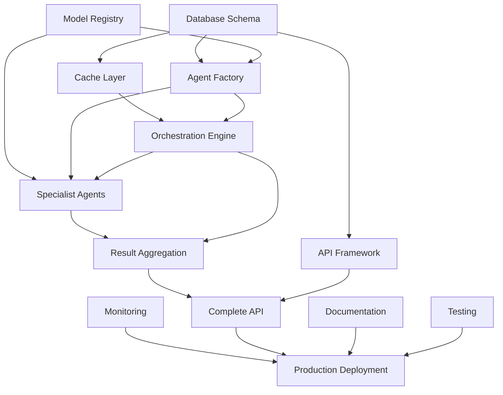

# Project Tahoe Agent Service - Claude Code Development Roadmap

## Project Summary
- **Purpose**: Multi-agent compliance analysis orchestration platform
- **Core Workflow**: Submit interaction → intelligent agent selection → parallel analysis → aggregated compliance scoring
- **Architecture**: Database-driven microservice with external state management (Postgres/Redis)
- **Development Approach**: Configuration-driven, stateless execution optimized for Claude Code autonomous implementation

## Implementation Phases

### Phase 1: Foundation Infrastructure
**Claude Code Session Scope**: Single session for core setup, multi-session for complete phase
**Delivers**: Working database, basic API framework, and core orchestration skeleton

#### Implementation Tasks
- [ ] **Database Schema**: Complete Prisma schema with all tables and relationships
- [ ] **API Framework**: FastAPI application with middleware, authentication, and basic endpoints
- [ ] **Core Orchestration**: Basic TahoeOrchestrator class with analysis workflow skeleton
- [ ] **Configuration Management**: Environment setup and service configuration system
- [ ] **Docker Environment**: Development containers for Postgres, Redis, and application

#### Technical Requirements
- Prisma schema with 8 core tables (AgentTemplate, Scorecard, Analysis, etc.)
- FastAPI app structure with CORS, authentication middleware
- Basic Redis connection and Postgres integration
- Environment variable management and service configuration
- Docker Compose setup for local development

#### Completion Criteria
- [ ] Database migrations run successfully
- [ ] API server starts and responds to health checks
- [ ] Redis and Postgres connections established
- [ ] Basic analysis endpoint accepts requests (returns placeholder)
- [ ] Docker environment fully operational

#### Session Strategy
- **Autonomous Scope**: Claude Code can implement complete database schema, API structure, and configuration
- **Context Preservation**: Store schema relationships and API patterns in memory for integration tasks
- **Validation Points**: Test database connections, API endpoint responses, service health checks

---

### Phase 2: Agent Infrastructure System
**Claude Code Session Scope**: Multi-session complexity
**Delivers**: Dynamic agent creation, model registry, and result aggregation framework

#### Implementation Tasks
- [ ] **Agent Factory**: Database-driven agent instantiation with template management
- [ ] **Model Registry**: Multi-provider support (Gemini, OpenAI, Anthropic) with configuration
- [ ] **Base Agent Framework**: Abstract base classes and standardized result structures
- [ ] **Result Aggregation**: Business rule engine for combining specialist agent outputs
- [ ] **Cache Management**: Redis patterns for agent templates, scorecards, and session data

#### Technical Requirements
- AgentFactory class with template loading and caching
- ModelRegistry supporting multiple providers with fallback handling
- BaseSpecialistAgent abstract class with AgentResult dataclass
- ResultAggregator with configurable business rules and thresholds
- Redis cache patterns with appropriate TTL strategies

#### Completion Criteria
- [ ] Agent factory creates agents from database templates
- [ ] Model registry routes requests to appropriate providers
- [ ] Base agent interface standardizes all specialist implementations
- [ ] Result aggregator combines outputs with weighted scoring
- [ ] Cache system improves performance with 90%+ hit rates

#### Session Strategy
- **Autonomous Scope**: Complete factory pattern implementation, registry design, and aggregation logic
- **Context Preservation**: Maintain agent interface contracts and aggregation rule patterns
- **Validation Points**: Test agent creation, model switching, aggregation accuracy

---

### Phase 3: Compliance Specialist Agents
**Claude Code Session Scope**: Multi-session complexity
**Delivers**: Production-ready compliance analysis agents with regulatory expertise

#### Implementation Tasks
- [ ] **Compliance Specialist**: FDCPA, TCPA, Reg F violation detection with evidence extraction
- [ ] **Quality Assessment**: Communication effectiveness scoring across multiple dimensions
- [ ] **Content Analysis**: Language processing for regulatory context and topic detection
- [ ] **Violation Detection**: Pattern matching with severity classification and evidence gathering
- [ ] **Recommendation Engine**: Contextual improvement suggestions based on violation patterns

#### Technical Requirements
- ComplianceSpecialistAgent with comprehensive regulatory rule sets
- QualityAssessmentAgent with 7 assessment dimensions
- ContentAnalyzer for language detection and topic extraction
- Pattern matching engines for violation detection
- Evidence extraction with context preservation

#### Completion Criteria
- [ ] Compliance agent detects FDCPA, TCPA, Reg F violations accurately
- [ ] Quality agent scores communication across all dimensions
- [ ] Content analyzer identifies regulatory context and complexity
- [ ] Violation detection includes severity scoring and evidence
- [ ] Recommendations are contextual and actionable

#### Session Strategy
- **Autonomous Scope**: Claude Code can implement complete regulatory logic and assessment algorithms
- **Context Preservation**: Maintain regulatory rule patterns and assessment criteria
- **Validation Points**: Test against known compliance scenarios and quality benchmarks

---

### Phase 4: Advanced Orchestration Engine
**Claude Code Session Scope**: Multi-session complexity
**Delivers**: Intelligent agent selection, parallel execution, and session management

#### Implementation Tasks
- [ ] **Content-Aware Selection**: Dynamic agent selection based on interaction analysis
- [ ] **Parallel Execution**: Concurrent agent processing with timeout and error handling
- [ ] **Session Management**: Redis-based progress tracking and state preservation
- [ ] **Execution Planning**: Dependency resolution and optimal agent ordering
- [ ] **Error Recovery**: Graceful failure handling and partial result processing

#### Technical Requirements
- Content analysis engine for agent selection triggers
- Async execution framework with configurable timeouts
- Redis session tracking with real-time status updates
- Execution plan optimization based on agent dependencies
- Comprehensive error handling with fallback strategies

#### Completion Criteria
- [ ] Agent selection adapts to interaction content and context
- [ ] Parallel execution handles multiple agents with proper timeout
- [ ] Session tracking provides real-time progress monitoring
- [ ] Execution planning optimizes agent ordering for efficiency
- [ ] Error recovery maintains service availability despite agent failures

#### Session Strategy
- **Autonomous Scope**: Complete orchestration logic with sophisticated execution management
- **Content Preservation**: Store execution patterns and optimization strategies
- **Validation Points**: Test complex scenarios with multiple agents and failure conditions

---

### Phase 5: Production API and Monitoring
**Claude Code Session Scope**: Multi-session complexity
**Delivers**: Complete production API with comprehensive monitoring and observability

#### Implementation Tasks
- [ ] **Complete API**: All endpoints with proper validation, error handling, and documentation
- [ ] **Authentication System**: Service token validation and request authorization
- [ ] **Metrics Collection**: Prometheus metrics for operational and business insights
- [ ] **Health Monitoring**: Comprehensive health checks for all dependencies
- [ ] **Configuration Management**: Dynamic configuration updates with cache invalidation

#### Technical Requirements
- FastAPI endpoints for analysis, configuration, status, and management
- JWT or service token authentication with proper middleware
- Prometheus metrics for requests, latency, errors, and business metrics
- Health check system for database, cache, models, and system resources
- Configuration management with hot reloading and cache invalidation

#### Completion Criteria
- [ ] All API endpoints documented and functioning with proper validation
- [ ] Authentication prevents unauthorized access to sensitive operations
- [ ] Metrics provide operational insights and business intelligence
- [ ] Health checks enable automated monitoring and alerting
- [ ] Configuration changes apply without service restart

#### Session Strategy
- **Autonomous Scope**: Complete API implementation with monitoring and configuration systems
- **Context Preservation**: Maintain API patterns and monitoring strategies
- **Validation Points**: Test API completeness, security, and monitoring accuracy

---

### Phase 6: Deployment and Optimization
**Claude Code Session Scope**: Single session for basic deployment, multi-session for optimization
**Delivers**: Production-ready deployment with performance optimization and documentation

#### Implementation Tasks
- [ ] **Container Optimization**: Multi-stage Docker builds with security hardening
- [ ] **Performance Tuning**: Database query optimization and connection pooling
- [ ] **Scaling Configuration**: Resource limits and horizontal scaling preparation
- [ ] **Documentation**: API documentation, deployment guides, and operational runbooks
- [ ] **Testing Framework**: Comprehensive test suite with integration and performance tests

#### Technical Requirements
- Optimized Dockerfile with non-root user and minimal attack surface
- Database connection pooling and query optimization
- Resource configuration for CPU, memory, and connection limits
- OpenAPI documentation and deployment automation scripts
- Pytest framework with unit, integration, and load testing

#### Completion Criteria
- [ ] Container builds efficiently with security best practices
- [ ] Performance meets target latency and throughput requirements
- [ ] Scaling configuration supports production load requirements
- [ ] Documentation enables independent deployment and operation
- [ ] Test suite provides confidence in deployment quality

#### Session Strategy
- **Autonomous Scope**: Claude Code can optimize containers, tune performance, and create documentation
- **Context Preservation**: Maintain optimization patterns and deployment configurations
- **Validation Points**: Performance benchmarks, security scans, documentation completeness

---

## Technical Components

### Database Schema (Prisma/PostgreSQL)
- **Function**: Single source of truth for agent templates, scorecards, and analysis results
- **Implementation**: Prisma ORM with migration management and type generation
- **Dependencies**: PostgreSQL database with connection pooling
- **Enables**: Dynamic agent configuration, result persistence, audit trails
- **Claude Code Complexity**: Single session for complete schema implementation

### Redis Cache Layer
- **Function**: High-performance caching and session state management
- **Implementation**: Redis with structured key patterns and TTL strategies
- **Dependencies**: Redis server with connection management
- **Enables**: Performance optimization, session tracking, configuration caching
- **Claude Code Complexity**: Single session for cache pattern implementation

### Google ADK Integration
- **Function**: Agent execution framework with tool support and model abstraction
- **Implementation**: ADK agents wrapped in Tahoe-specific interfaces
- **Dependencies**: Google ADK library and model provider APIs
- **Enables**: Standardized agent execution, tool integration, model flexibility
- **Claude Code Complexity**: Single session for integration wrapper implementation

### Multi-Model Provider Support
- **Function**: Provider-agnostic model access with fallback and routing
- **Implementation**: Registry pattern with provider-specific adapters
- **Dependencies**: API keys and provider client libraries
- **Enables**: Model flexibility, cost optimization, availability resilience
- **Claude Code Complexity**: Single session for registry implementation

### Orchestration Engine
- **Function**: Core workflow management and agent coordination
- **Implementation**: Async execution with parallel and sequential phases
- **Dependencies**: Agent factory, model registry, cache layer
- **Enables**: Intelligent analysis workflows, performance optimization
- **Claude Code Complexity**: Multi-session for complete orchestration logic

### Specialist Agent Framework
- **Function**: Domain-specific analysis capabilities with standardized interfaces
- **Implementation**: Abstract base classes with specialized implementations
- **Dependencies**: Agent infrastructure, model providers, regulatory data
- **Enables**: Modular analysis capabilities, extensible specialist library
- **Claude Code Complexity**: Multi-session for complete specialist suite

### Result Aggregation System
- **Function**: Business rule-driven combination of specialist agent outputs
- **Implementation**: Configurable aggregation with weighted scoring and thresholds
- **Dependencies**: Agent results, business rules configuration
- **Enables**: Consistent scoring, business logic flexibility, audit trails
- **Claude Code Complexity**: Single session for aggregation logic

### API Gateway (FastAPI)
- **Function**: HTTP interface with authentication, validation, and documentation
- **Implementation**: FastAPI with middleware for security and monitoring
- **Dependencies**: Authentication system, request validation schemas
- **Enables**: External integration, service consumption, operational monitoring
- **Claude Code Complexity**: Multi-session for complete API implementation

### Monitoring and Observability
- **Function**: Operational insights, health monitoring, and performance tracking
- **Implementation**: Prometheus metrics with structured logging and health checks
- **Dependencies**: Metrics collection infrastructure, logging aggregation
- **Enables**: Production operations, performance optimization, incident response
- **Claude Code Complexity**: Single session for monitoring implementation

## Component Dependency Map

## Success Metrics

### Technical Performance
- **API Response Time**: < 200ms for analysis submission
- **Analysis Completion**: < 30 seconds for full workflow
- **Cache Hit Rate**: > 90% for configuration data
- **Error Rate**: < 1% for successful requests

### Business Functionality
- **Compliance Accuracy**: > 95% detection rate for known violations
- **Quality Scoring**: Consistent assessment across interaction types
- **Recommendation Relevance**: > 80% actionable recommendations
- **Audit Completeness**: Full traceability for all analysis decisions

### Operational Excellence
- **Service Availability**: > 99.9% uptime
- **Scaling Capability**: Handle 100+ concurrent analyses
- **Configuration Flexibility**: Hot-reload without service restart
- **Monitoring Coverage**: Complete observability for all components

This roadmap optimizes for Claude Code's autonomous development capabilities while ensuring each phase delivers complete, testable functionality that builds toward a production-ready multi-agent compliance analysis platform.