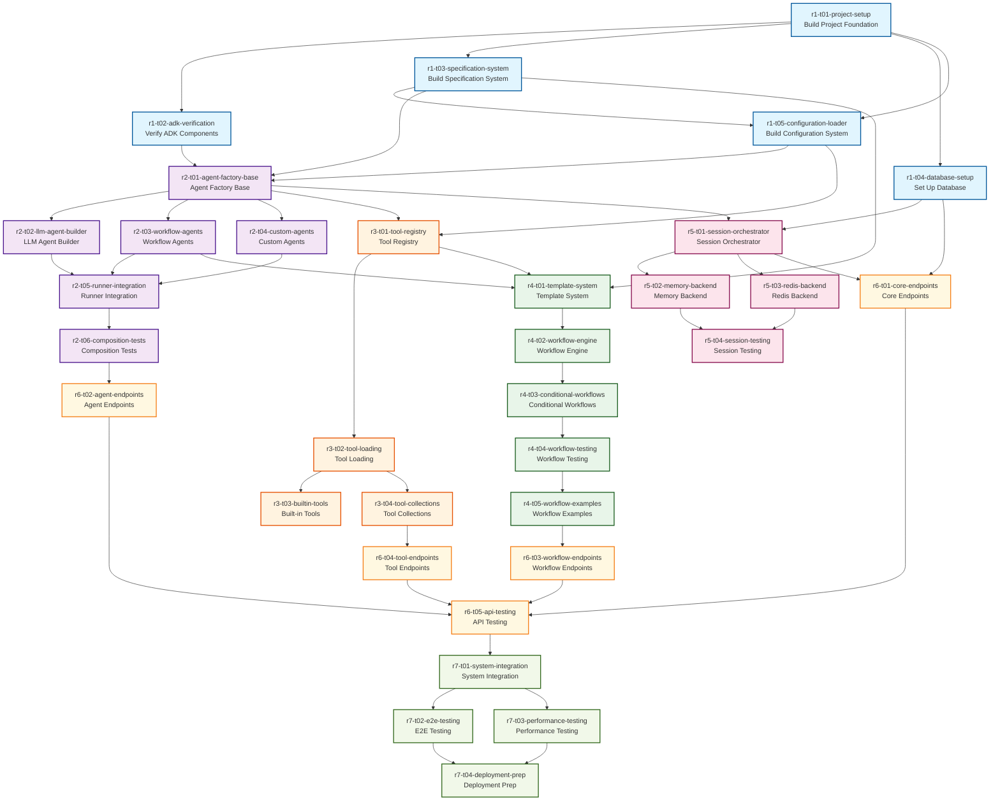

# Task Dependencies - Project Tahoe

## Overview
This document visualizes the task dependencies for building the universal agent engine. Each release builds upon the previous, with specific inter-task dependencies within releases.

## Dependency Graph

## Dependency Rules

### Inter-Release Dependencies
1. **R1 (Foundation)** - No external dependencies, establishes base
2. **R2 (Composition)** - Requires R1 completion
3. **R3 (Tools)** - Requires R1 and R2 base components
4. **R4 (Workflows)** - Requires R1, R2, and R3
5. **R5 (Sessions)** - Requires R1 and R2
6. **R6 (API)** - Requires all previous releases
7. **R7 (Integration)** - Requires all components complete

### Critical Path
The critical path through the project:
1. `r1-t01` → `r1-t02` → `r2-t01` → `r2-t02` → `r2-t05` → `r2-t06` → `r6-t02` → `r6-t05` → `r7-t01` → `r7-t04`

### Parallel Execution Opportunities
Tasks that can be executed in parallel once dependencies are met:

**After R1-T01:**
- `r1-t02`, `r1-t03`, `r1-t04` can run in parallel

**After R2-T01:**
- `r2-t02`, `r2-t03`, `r2-t04` can run in parallel

**After R3-T02:**
- `r3-t03`, `r3-t04` can run in parallel

**After R5-T01:**
- `r5-t02`, `r5-t03` can run in parallel

**After R6-T01:**
- `r6-t02`, `r6-t03`, `r6-t04` can run in parallel

## Task Groupings by Function

### Core Infrastructure
- `r1-t01`: Project setup
- `r1-t04`: Database
- `r1-t05`: Configuration
- `r5-t01`: Session orchestration

### ADK Integration
- `r1-t02`: ADK verification
- `r2-t01`: Agent factory
- `r2-t05`: Runner integration

### Specification System
- `r1-t03`: Specification parser
- `r4-t01`: Template system

### Agent Composition
- `r2-t02`: LLM agents
- `r2-t03`: Workflow agents
- `r2-t04`: Custom agents

### Tool System
- `r3-t01`: Registry
- `r3-t02`: Loading
- `r3-t03`: Built-in tools
- `r3-t04`: Collections

### Workflow Engine
- `r4-t02`: Core engine
- `r4-t03`: Conditional logic
- `r4-t05`: Examples

### API Layer
- `r6-t01`: Core endpoints
- `r6-t02`: Agent endpoints
- `r6-t03`: Workflow endpoints
- `r6-t04`: Tool endpoints

### Testing & Integration
- `r2-t06`: Composition tests
- `r4-t04`: Workflow tests
- `r5-t04`: Session tests
- `r6-t05`: API tests
- `r7-t02`: E2E tests
- `r7-t03`: Performance tests

## Implementation Strategy

### Phase 1: Foundation (R1)
**Duration**: 1-2 days  
**Focus**: Establish development environment and core infrastructure  
**Key Deliverable**: Working FastAPI app with ADK integration

### Phase 2: Core Engine (R2-R3)
**Duration**: 2-3 days  
**Focus**: Build agent composition and tool systems  
**Key Deliverable**: Dynamic agent creation from specifications

### Phase 3: Orchestration (R4-R5)
**Duration**: 2-3 days  
**Focus**: Workflow engine and session management  
**Key Deliverable**: Complete workflow execution system

### Phase 4: API & Integration (R6-R7)
**Duration**: 2-3 days  
**Focus**: REST API and system integration  
**Key Deliverable**: Production-ready system

## Risk Mitigation

### Technical Risks
1. **ADK Integration Issues**
   - Mitigation: Early verification in R1-T02
   - Fallback: Direct ADK support consultation

2. **Performance Bottlenecks**
   - Mitigation: Performance testing in R7-T03
   - Fallback: Optimization phase if needed

3. **Complex Dependencies**
   - Mitigation: Clear dependency tracking
   - Fallback: Sequential execution if parallel fails

### Schedule Risks
1. **Task Overruns**
   - Mitigation: Conservative time estimates
   - Fallback: Prioritize critical path tasks

2. **Integration Delays**
   - Mitigation: Early integration testing
   - Fallback: Incremental integration approach

## Success Metrics

### Per-Release Metrics
- **R1**: All ADK imports work, health endpoint responds
- **R2**: Agent creation < 100ms, all types supported
- **R3**: Tool registration functional, validation passes
- **R4**: Workflow execution streaming works
- **R5**: Session persistence operational
- **R6**: All API endpoints return < 500ms
- **R7**: E2E tests pass, deployment successful

### Overall Project Metrics
- Test coverage > 80%
- API response time < 500ms (p95)
- Agent composition time < 100ms
- Zero critical security vulnerabilities
- Documentation complete

## Notes for Implementation

### Starting a Task
1. Read the task YAML file completely
2. Check all dependencies are complete
3. Review ADK patterns documentation
4. Set up test cases first (TDD approach)

### Completing a Task
1. Run all validation commands
2. Ensure tests pass with coverage
3. Update project-context.md
4. Mark task complete in tracking

### Session Handoffs
When switching between sessions:
1. Complete current task or reach stable checkpoint
2. Update session notes in task file
3. Commit all changes with clear message
4. Document any blockers or decisions needed